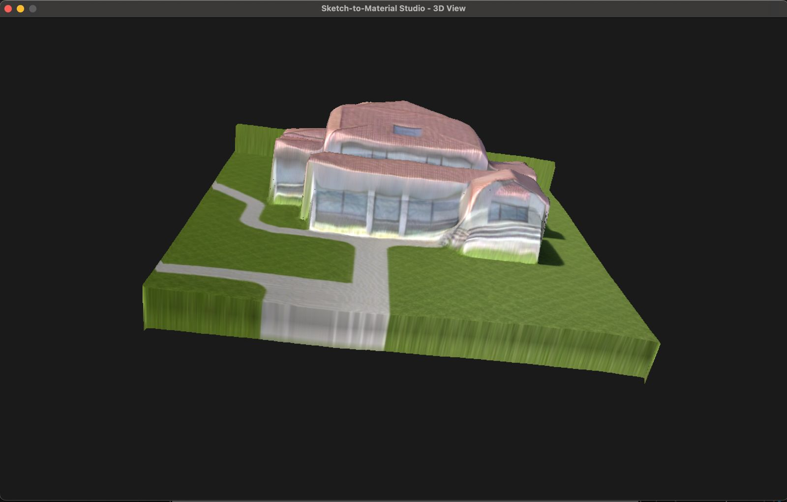
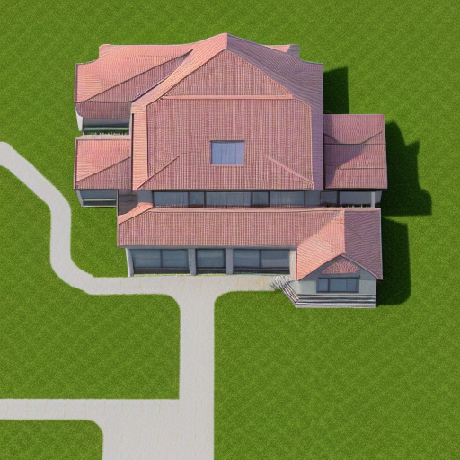
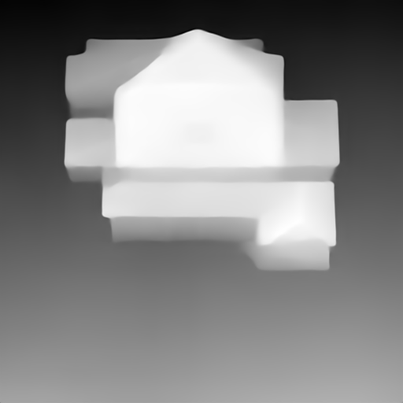
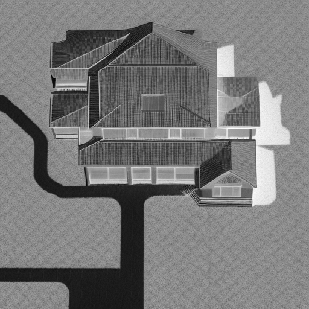

# Sketch-to-Material Studio

A computer graphics application that combines classical OpenGL rendering with AI-based texture generation. Transform your 2D sketches into interactive 3D materials using Stable Diffusion and depth estimation models.



## Demo Video

Watch the demo videos to see the application in action:

📹 [Demo Videos](https://drive.google.com/drive/folders/1LKZ917a3fby3fEOwwzvlbfAKKNbthBI5?usp=sharing)

## Requirements

- **Python**: 3.8 or higher
- **GPU**: NVIDIA GPU with CUDA support (recommended) or Apple Silicon (MPS) or CPU (slower)
- **RAM**: Minimum 8GB (16GB+ recommended)
- **Storage**: ~10GB free space for model downloads

## Installation

### Step 1: Create Virtual Environment

**Windows:**
```bash
python -m venv env
env\Scripts\activate
```

**macOS/Linux:**
```bash
python3 -m venv env
source env/bin/activate
```

### Step 2: Install Dependencies

```bash
pip install -r requirements.txt
```

### Step 3: Pre-Download AI Models (Recommended)

Run this script once to download all AI models (~4-5GB):

```bash
python prepare_models.py
```

**Note**: If you skip this step, models will be downloaded automatically on first run.

## Usage

### Running the Application

```bash
python main_sketch.py
```

### Basic Workflow

1. **Draw or Upload Sketch**
   - Draw on the canvas with your mouse
   - Or drag & drop an image file onto the window
   - Use number keys (1-5) to select colors
   - Press 'C' to clear the canvas

   

2. **Generate 3D Material**
   - Press **ENTER** to start generation
   - Enter a text prompt in the console (e.g., "wood texture", "brick wall", "marble")
   - Wait for AI processing (may take 1-3 minutes depending on hardware)

3. **View 3D Result**
   - The application automatically switches to 3D view mode
   - Drag with left mouse button to rotate camera
   - Press **ESC** to return to paint mode

   

### Generated Texture Maps

The application generates several texture maps for realistic 3D rendering:

| Albedo | Depth | Normal | Roughness |
|--------|-------|--------|-----------|
|  |  |  |  |

## Authors

- **Carleano Ravelza Wongso** - carleano.ravelza@ui.ac.id
- **Andrew Devito Aryo** - andrew.devito@ui.ac.id
- **Arya Raditya Kusuma** - arya.raditya@ui.ac.id
- **Tristan Agra Yudhistira** - tristan.agra@ui.ac.id

---

**CSCE604029 • Computer Graphics • Semester Gasal 2025/2026**  
**Fakultas Ilmu Komputer, Universitas Indonesia**