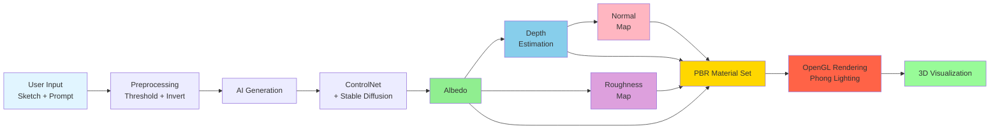

# Sketch-to-Material Studio Pipeline

## Short Version (16:9 Aspect Ratio)



## Detailed Version

```mermaid
flowchart TD
    Start([User Input]) --> Sketch[2D Sketch<br/>Canvas Drawing]
    Start --> Prompt[Text Prompt<br/>Material Description]
    
    Sketch --> Preprocess[Sketch Preprocessing]
    Preprocess --> Resize[Resize to 512x512]
    Resize --> Grayscale[Convert to Grayscale]
    Grayscale --> Binary[Binary Threshold<br/>Threshold: 127]
    Binary --> Invert[Invert Colors]
    Invert --> ProcessedSketch[Processed Sketch<br/>Edge Map]
    
    ProcessedSketch --> ControlNet[ControlNet<br/>Scribble Variant]
    Prompt --> ControlNet
    ControlNet --> StableDiff[Stable Diffusion v1.5<br/>+ UniPCMultistepScheduler<br/>30 Steps, Scale: 0.7]
    StableDiff --> Albedo[Albedo Texture<br/>512x512 RGB]
    
    Albedo --> RoughnessGen[Roughness Generation]
    RoughnessGen --> GrayConvert[Convert to Grayscale]
    GrayConvert --> Normalize1[Normalize 0-255]
    Normalize1 --> Invert1[Invert Values]
    Invert1 --> Roughness[Roughness Map<br/>512x512]
    
    Albedo --> DepthEst[Depth Estimation<br/>Depth-Anything-Small]
    DepthEst --> DepthRaw[Raw Depth Map]
    DepthRaw --> Normalize2[Normalize Depth Values]
    Normalize2 --> Depth[Depth Map<br/>512x512]
    
    Depth --> NormalGen[Normal Map Generation]
    NormalGen --> SobelX[Sobel X Gradient<br/>Kernel Size: 5]
    NormalGen --> SobelY[Sobel Y Gradient<br/>Kernel Size: 5]
    SobelX --> Combine[Combine Gradients<br/>+ Base Normal Component]
    SobelY --> Combine
    Combine --> Normalize3[Normalize Vectors]
    Normalize3 --> Encode[Encode to RGB<br/>0-255 Range]
    Encode --> Normal[Normal Map<br/>512x512]
    
    Albedo --> MaterialSet[PBR Material Set]
    Depth --> MaterialSet
    Normal --> MaterialSet
    Roughness --> MaterialSet
    
    MaterialSet --> SaveProject[Save to Project Folder]
    SaveProject --> LoadTextures[Load Textures to GPU]
    
    LoadTextures --> OpenGL[OpenGL 3.3 Pipeline]
    OpenGL --> Geometry[200x200 Grid Mesh<br/>VAO/VBO/EBO]
    Geometry --> VertexShader[Vertex Shader<br/>Displacement Mapping]
    VertexShader --> FragmentShader[Fragment Shader<br/>Phong Lighting]
    
    FragmentShader --> Lighting[Phong Illumination<br/>Ambient + Diffuse + Specular]
    Lighting --> TextureSampling[Multi-Texture Sampling<br/>Albedo, Depth, Normal, Roughness]
    TextureSampling --> Rendering[3D Rendering<br/>Real-time Interactive]
    
    Rendering --> Camera[Orbital Camera<br/>Mouse Drag Control]
    Camera --> Display[3D Visualization<br/>Windowed Mode]
    
    style Start fill:#e1f5ff
    style Albedo fill:#90ee90
    style Depth fill:#87ceeb
    style Normal fill:#ffb6c1
    style Roughness fill:#dda0dd
    style MaterialSet fill:#ffd700
    style OpenGL fill:#ff6347
    style Display fill:#98fb98
```



## Pipeline Stages

### 1. Input Stage
- **User Sketch**: Drawn on canvas or uploaded image
- **Text Prompt**: Material description (e.g., "wood texture", "metal surface")

### 2. Preprocessing Stage
- Resize sketch to 512x512
- Convert to grayscale
- Apply binary thresholding (threshold: 127)
- Invert colors to create edge map for ControlNet

### 3. AI Generation Stage

#### 3.1 Texture Synthesis (ControlNet + Stable Diffusion)
- **Input**: Processed sketch + text prompt
- **Model**: Stable Diffusion v1.5 with ControlNet (scribble)
- **Scheduler**: UniPCMultistepScheduler
- **Parameters**: 
  - 30 inference steps
  - ControlNet scale: 0.7
  - Guidance scale: 8.0
- **Output**: Albedo texture (512x512)

#### 3.2 Roughness Map Generation
- **Input**: Albedo texture
- **Process**: Grayscale conversion → Normalize → Invert
- **Output**: Roughness map (512x512)

#### 3.3 Depth Estimation
- **Input**: Albedo texture
- **Model**: Depth-Anything-Small
- **Process**: Depth prediction → Normalize to 0-255
- **Output**: Depth map (512x512)

#### 3.4 Normal Map Generation
- **Input**: Depth map
- **Process**: 
  - Compute Sobel gradients (X and Y, kernel size 5)
  - Combine with base normal component (500.0)
  - Normalize vectors
  - Encode to RGB (0-255 range)
- **Output**: Normal map (512x512)

### 4. Material Assembly
- Combine all maps into PBR material set:
  - Albedo (base color)
  - Depth (displacement)
  - Normal (surface detail)
  - Roughness (specular control)
- Save to project folder

### 5. Classical Rendering Stage

#### 5.1 Geometry Setup
- Create 200x200 grid mesh
- Setup VAO, VBO, EBO for GPU rendering

#### 5.2 Vertex Shader
- Sample depth texture
- Displace vertices along normals
- Displacement strength: 0.3

#### 5.3 Fragment Shader
- **Phong Lighting Model**:
  - Ambient: 0.2 constant
  - Diffuse: Lambertian reflection
  - Specular: Blinn-Phong (shininess: 32)
- **Texture Sampling**:
  - Albedo for base color
  - Normal for surface detail
  - Roughness for specular modulation
  - Depth for displacement

#### 5.4 Camera & Display
- Orbital camera system
- Mouse drag for rotation
- Real-time 60 FPS rendering
- Windowed mode display

## Data Flow Summary

```
User Sketch + Prompt
    ↓
Preprocessing (Threshold + Invert)
    ↓
ControlNet + Stable Diffusion
    ↓
Albedo Texture
    ├─→ Roughness Map (Grayscale + Invert)
    └─→ Depth Map (Depth-Anything Model)
            ↓
        Normal Map (Sobel Gradients)
    ↓
PBR Material Set (4 Maps)
    ↓
OpenGL Rendering Pipeline
    ↓
3D Interactive Visualization
```

